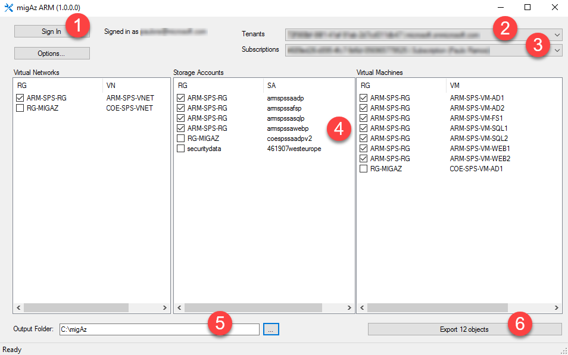
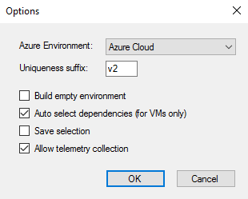

# Azure Resource Manager IaaS to Azure Resource Manager IaaS migration using migAz ARM

This article will show you how to use migAz ARM to migrate or clone Azure Resource Manager IaaS solutions to Azure Resource Manager IaaS. Refer the [link](https://docs.microsoft.com/en-us/azure/azure-resource-manager/resource-group-move-resources) to know more about the Azure native supported method to move the resource around Azure Resource Manager to Azure Resource Manager model.

This project has adopted the [Microsoft Open Source Code of Conduct](https://opensource.microsoft.com/codeofconduct/). For more information see the [Code of Conduct FAQ](https://opensource.microsoft.com/codeofconduct/faq/) or contact [opencode@microsoft.com](mailto:opencode@microsoft.com) with any additional questions or comments.

## What it does

Azure Resource Manager to Azure Resource Manager migration tool for IaaS workloads (migAz ARM) is an additional option to migrate a complete set of Azure Resource Manager IaaS resources to Azure Resource Manager IaaS resources. The migration can occur within the same subscription or between different subscriptions and subscription types (ex: CSP subscriptions).

This article provides the functional details to use the tool for Azure Resource Manager to Azure Resource Manager migration of IaaS workloads. The tool exports the following resources:

**For Virtual Networks the tool exports following object types**

- Virtual networks

- Subnets

- VPN gateways

- Public IP

- Connections

- Local gateways

- Network security groups

- Route tables

- Load Balancer
- Inbound NAT rules
- Load balancing rules

**For Storage Accounts the tool exports the following object type**

- Storage Account

**For Virtual Machines the tool exports the following object types**

- Virtual machines

- Network interfaces

- Availability Sets

The tool uses Resource Manager REST API calls to gather all the details on Network, Storage and Compute related resources. As per your selection, all the related configurations are exported into the JSON file which can be used for the deployment into Azure Resource Manager. The files created during the process are listed below:

- **Export.JSON** - This is the ARM template that the tool generates

- **Copyblobdetails.JSON** - This file contains the Source and Target Storage Accounts with their keys to access them for the blob copy

- **MIGAZ-&lt;YYYYMMDD&gt;.log** - This file is created in the %USERPROFILE%\appdata\Local\MIGAZ and record each steps processed in the tool

- **MIGAZ-JSON-<YYYYMMDD>.log** - This file is created in the %USERPROFILE%\appdata\Local\MIGAZ and it is an export of the raw xml captured and processed from the REST API calls

 
> Migrating resources with these tool will require a small downtime for your Virtual Machines. It is recommened to plan for the downtime before the Migration. 

 

> migAz is not supported by Microsoft Support, but for the critical steps uses two powershell cmdlets that are fully supported: New-AzureRmResourceGroupDeployment and Start-AzureStorageBlobCopy. It is open sourced on Github and we're happy to accept pull requests for fixes or additional features.

 

### Launch migAz.exe

**Step 1:** Click the “Sign In” button. The “Sign In” button will launch the Azure Authentication page and user has to enter the credentials to access the source subscription.

Post successful authentication the Tenants and the Subscriptions will be loaded.

**Step 2:** Select one of the Tenants from the list and wait for the subscriptions to completely load. The status bar will show as “Ready” when all the subscriptions are loaded.

**Step 3:** Select one of the Subscriptions from the list and wait for the components to completely load. The status bar will show as “Ready” when all the components are loaded.

**Step 4:** The tool can export the configurations of Virtual Networks, Storage and Virtual Machine. User can select any of them or combination of the resources to export.

**Step 5:** The Export Objects button will be enabled only after choosing the Output folder. Once the resources are selected and Output Folder is set, user can click on Export Objects.

**Step 6:** The Export Objects will then collect all the properties of selected resources and create a JSON Template and a blob details file in the Output Folder selected.

**Step 7:** Once the export completes, click the "Next Steps" tab to generate a customized documentation page showing how to deploy
the template to your Azure environment. Alternatively follow the instructions below to start the deployment of the template using the cmdlet:

    New-AzureRmResourceGroupDeployment -Name "<Deployment Name>" -ResourceGroupName "<Resource Group Name>" -TemplateFile "<full path of the export.JSON>" -Verbose

> If virtual machines were included on the export, an error will show up stating that the virtual machines VHDs were not found. This is expected since the blobs haven’t been copied yet to the new storage accounts.

Execute steps 7 to 9 only if virtual machines were included on the export.

**Step 8:** initiate and complete the blob copy of the required OS disks and data disks using BlobCopy.PS1 script

> BlobCopy.ps1 script creates temporary snapshots to copy the blobs. This means that it will be able to copy disks from running virtual machines. But, depending on the workload, it can be absolutely required to stop the virtual machine to guarantee data consistency. This is the case, for example, for virtual machines using multiple data disks to create stripped volumes (like storage spaces).

1.This command will initiate the asynchronous copy of the Storage Blobs

    .\BlobCopy.ps1 -ResourcegroupName "<Resource Group Name>" -DetailsFilePath "<Full Path of copyblobdetails.JSON>" -StartType StartBlobCopy

2.This command will monitor and show the progress of the copy

    .\BlobCopy.ps1 -ResourcegroupName "<Resource Group Name>" -DetailsFilePath "<Full Path of copyblobdetails.JSON>" -StartType MonitorBlobCopy

> Always run above commands in sequence. The first, creates the snapshots and initiate the asynchronous copies. The second, will monitor the asynchronous copy status of each blob and clean the snapshots at the end.

> Additional note: if you need to cancel the blobs copy jobs run this command

    .\BlobCopy.ps1 -ResourcegroupName "<Resource Group Name>" -DetailsFilePath "<Full Path of copyblobdetails.JSON>" -StartType CancelBlobCopy

**Step 9:** Once the BlobCopy is completed re-deploy the export.JSON template (step 7) since the VHD’s required for the virtual machines are available now.

**Step 10:** Because the tool creates a Load Balancer matching each Cloud Service, after the migration is complete, you need to change the DNS records that were pointing to the Cloud Service DNS name or IP to point to the new Load Balancer DNS name or IP.

## Tool Options

### Uniqueness suffix

When exporting storage accounts and loadbalancers, the tool appends to the resource name the “uniqueness suffix” string to avoid names conflicts. You have the option to change this uniqueness suffix string.

### Build empty environment

If this option is selected, the selected virtual machines will be exported to export.json file as new virtual machines with empty data disks. By default, Windows virtual machines will be created using Windows Server 2012 R2 Datacenter SKU and Linux virtual machine will be created using Ubuntu Server 16.04.0-LTS SKU. You can change this by editing the export.json template and change the image references.

### Auto select dependencies

If this option is selected, when you select a Virtual Machine, any dependent Virtual Network and Storage Accounts are selected automatically.

### Save selection

If this option is selected, migAz will record the last selected resources per each subscription. When you reopen the tool, the same resources will be automatically selected.

### Allow telemetry collection

“Allow telemetry collection” is enabled by default. It is used to collect information such as Tenant ID, Subscription ID, Processed Resource Type, Processed Resource Location and the Execution date. This data is collected only to know the tool usage and it will remain only with the development team. You can disable this at any time.

### Azure Environment

To enable deployment of the ARM template to the new Microsoft National Clouds you can choose from the options windows which cloud you want to use.

## Scenarios

### Migration using new virtual network with different address space
One of the biggest priorities when planning for an ARM to ARM migration is to minimize the solution downtime. When possible, application level data replication is the option that guarantees minimal downtime, for example using SQL Server AlwaysOn replication.

If the migration scenario allows to create a new ARM virtual network with a different address space, you can create a VNet Peering or Site-to-Site VPN connecting both ARM virtual networks. This will allow you to deploy an additional server on the new ARM environment, replicate the data and failover service with minimal downtime.

You can leverage migAz to help on the migration of servers that do not require data replication, like application servers and web servers.

### Migration using new virtual network with same address space
If it’s not possible to have a new ARM virtual network with a different address space, you will use the tool to migrate all solution virtual machines, but you need to plan for a larger downtime window. The downtime will be as large as the largest virtual machine to migrate (largest = OS disk used space + all data disks used space).

Because the tool uses snapshots to copy the blobs, you can use the tool without stopping any virtual machine and test how much downtime you need to plan for the data migration process.

### Clone environment for testing
Planning and testing are key for a successful migration. The tool enables you to create a full copy of the environment and test it when deployed to ARM. This will allow you to proactively identify any configuration change required during the final migration execution.

### Clone environment with new virtual machines and data disks
It’s entirely possible that you opt for a full redeployment of the solution during the migration to ARM environment. The tool can help you to setup a new environment with similar configuration but with new and empty virtual machines.

Use “Build empty environment” option to enable this.

## Notes

### Storage account names
As the Storage Accounts supports a maximum of 24 characters in the name, and the tool adds the "uniqueness string" in the target Storage Account name, it is possible that the deployment fails if the name exceeds the limit. In such cases you need to modify the export.JSON and copyblobdetails.JSON to make it 24 characters. This is also true if the target Storage Account name is already in use.
