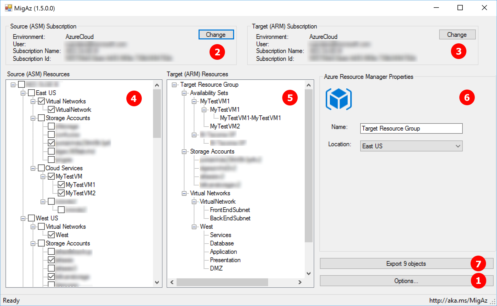
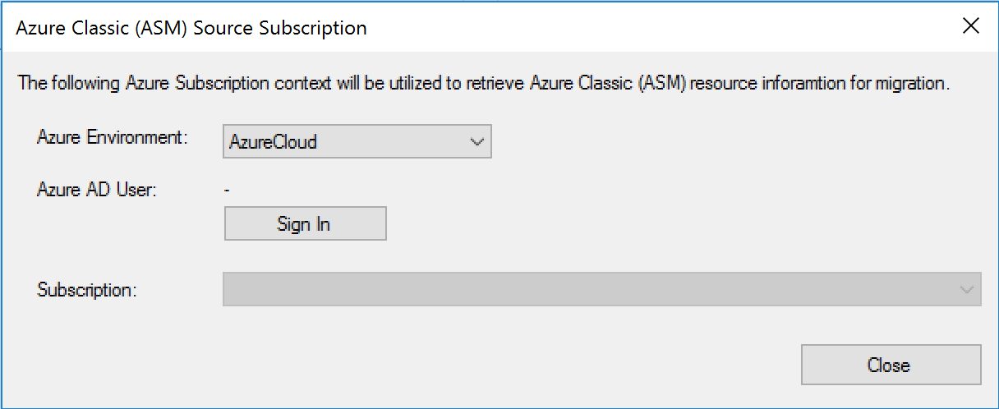

# Classic IaaS to Azure Resource Manager IaaS migration using migAz ASM

This article will show you how to use migAz to migrate or clone classic IaaS solutions to Azure Resource Manager IaaS.

This project has adopted the [Microsoft Open Source Code of Conduct](https://opensource.microsoft.com/codeofconduct/). For more information see the [Code of Conduct FAQ](https://opensource.microsoft.com/codeofconduct/faq/) or contact [opencode@microsoft.com](mailto:opencode@microsoft.com) with any additional questions or comments.

## What it does

The Azure Service Management to Azure Resource Manager migration tool for IaaS workloads (migAz) is an additional option to migrate a complete set of Azure Service Management IaaS resources to Azure Resource Manager IaaS resources. The migration can occur within the same subscription or between different subscriptions and subscription types (ex: CSP subscriptions).

This article provides the functional details to use the tool for Azure Service Management to Azure Resource Manager migration of IaaS workloads. The tool exports the following resources:

**For Virtual Networks the tool exports the ARM corresponding object types**

- Virtual networks

- Subnets

- VPN gateways

- Public IP

- Connections

- Local gateways

- Network security groups

- Route tables

**For Storage Accounts the tool exports the ARM corresponding object type**

- Storage Account

**For Cloud Services the tool exports the ARM corresponding object types**

- Load Balancer

- Inbound NAT rules

- Load balancing rules

- Public IP

**For Virtual Machines the tool exports the ARM corresponding object types**

- Virtual machines

- Network interfaces

- Availability Sets

The tool uses Service Management REST API calls to gather all the details on Network, Storage and Compute related resources. As per your selection, all the related configurations are exported into the JSON file which can be used for the deployment into Azure Resource Manager. The files created during the process are listed below:

- **Export.JSON** - This is the ARM template that the tool generates

- **Copyblobdetails.JSON** - This file contains the Source and Target Storage Accounts with their keys to access them for the blob copy

- **MIGAZ-&lt;YYYYMMDD&gt;.log** - This file is created in the %USERPROFILE%\appdata\Local\MIGAZ and record each steps processed in the tool

- **MIGAZ-XML-&lt;YYYYMMDD&gt;.log** - This file is created in the %USERPROFILE%\appdata\Local\MIGAZ and it is an export of the raw xml captured and processed from the REST API calls

 
> Migrating resources with these tool will cause downtime for your classic Virtual Machines. If you're looking for platform supported migration, please visit 

- [Platform supported migration of IaaS resources from Classic to Azure Resource Manager stack](https://azure.microsoft.com/en-us/blog/iaas-migration-classic-resource-manager/)
- [Technical Deep Dive on Platform supported migration from Classic to Azure Resource Manager](https://azure.microsoft.com/en-us/documentation/articles/virtual-machines-windows-migration-classic-resource-manager-deep-dive)
- [Migrate IaaS resources from Classic to Azure Resource Manager using Azure PowerShell](https://azure.microsoft.com/en-us/documentation/articles/virtual-machines-windows-ps-migration-classic-resource-manager)

 

> migAz is not supported by Microsoft Support, but for the critical steps uses two powershell cmdlets that are fully supported: New-AzureRmResourceGroupDeployment and Start-AzureStorageBlobCopy. It is open sourced on Github and we're happy to accept pull requests for fixes or additional features.

 

### Launch migAz.exe

**Step 1:** View the options dialog and set MigAz options prior to utilizing MigAz for ARM Template generation.

**Step 2:** From the File Menu, select New Migration -> ASM to ARM.

Begin by selected the Azure Environment that you are going to authentication to.  Next, click the “Sign In” button to launch the Azure Authentication page and complete the user authentication process against Azure AD using the credentials that have access the source subscription.

If the account used to authenticate to Azure AD has access to multiple subscription, select Azure subscription you would like to use as the ASM (Source) Subscription.  Upon successfully authenticating to Azure AD and selecting your ASM (Source) Subscription, MigAz will begin querying the existing Azure Resources within the subscription.  The status bar will show as “Ready” when all the Azure Resources are loaded for the subscription.

**Step 3:** If the ARM (Target) Azure Subscription that you want to migrate exported ASM resources into is a different subscription than the ASM (Source) Subscription, click the "Change" button to use select a different subscription available to the Azure AD user account that was used for authentication.

**Step 4:** The tool can export the configurations of Virtual Networks, Storage and Virtual Machine.  Utilize the ASM Tree View to explore and select the ASM (Source) objects that you want to export into the ARM Template.  User can select any of them or combination of the resources to export.

**Step 5:** Utilize the ARM (Target) Tree View to explorer and revise the ARM (Target) defintion.  Upon selecting an ARM (Target) resource in the Tree View, the ARM Properties pane will present infomation about the selected object.

**Step 6:** Utilize the ARM Properties interface to view and refine ARM Template details prior to generating the ARM Template.

**Step 7:** The Export button will be enabled only after selecting ASM objects for export.  Upon clicking the Export button, MigAz will conduct a pre-export health check and may prompt for required inputs (such as Target Location, missing names, missing target VNet/Subnet/Storage Account, etc.)

**Step 8:** Once the export completes, view the HTML based deployment instructions showing how to deploy
the template to your Azure environment. Alternatively follow the instructions below to start the deployment of the template using the cmdlet:

    New-AzureRmResourceGroupDeployment -Name "<Deployment Name>" -ResourceGroupName "<Resource Group Name>" -TemplateFile "<full path of the export.JSON>" -Verbose

> If virtual machines were included on the export, an error will show up stating that the virtual machines VHDs were not found. This is expected since the blobs haven’t been copied yet to the new storage accounts.

Execute steps 9 to 11 only if virtual machines were included on the export.

**Step 9:** initiate and complete the blob copy of the required OS disks and data disks using BlobCopy.PS1 script

> BlobCopy.ps1 script creates temporary snapshots to copy the blobs. This means that it will be able to copy disks from running virtual machines. But, depending on the workload, it can be absolutely required to stop the virtual machine to guarantee data consistency. This is the case, for example, for virtual machines using multiple data disks to create stripped volumes (like storage spaces).

1.This command will initiate the asynchronous copy of the Storage Blobs

    .\BlobCopy.ps1 -ResourcegroupName "<Resource Group Name>" -DetailsFilePath "<Full Path of copyblobdetails.JSON>" -StartType StartBlobCopy

2.This command will monitor and show the progress of the copy

    .\BlobCopy.ps1 -ResourcegroupName "<Resource Group Name>" -DetailsFilePath "<Full Path of copyblobdetails.JSON>" -StartType MonitorBlobCopy

> Always run above commands in sequence. The first, creates the snapshots and initiate the asynchronous copies. The second, will monitor the asynchronous copy status of each blob and clean the snapshots at the end.

> Additional note: if you need to cancel the blobs copy jobs run this command

    .\BlobCopy.ps1 -ResourcegroupName "<Resource Group Name>" -DetailsFilePath "<Full Path of copyblobdetails.JSON>" -StartType CancelBlobCopy

**Step 10:** Once the BlobCopy is completed re-deploy the export.JSON template (step 7) since the VHD’s required for the virtual machines are available now.

**Step 11:** Because the tool creates a Load Balancer matching each Cloud Service, after the migration is complete, you need to change the DNS records that were pointing to the Cloud Service DNS name or IP to point to the new Load Balancer DNS name or IP.

## Tool Options

### Build empty environment

If this option is selected, the selected virtual machines will be exported to export.json file as new virtual machines with empty data disks. By default, Windows virtual machines will be created using Windows Server 2012 R2 Datacenter SKU and Linux virtual machine will be created using Ubuntu Server 16.04.0-LTS SKU. You can change this by editing the export.json template and change the image references.

### Auto select dependencies

If this option is selected, when you select a Virtual Machine, any dependent Virtual Network and Storage Accounts are selected automatically.

### Save selection

If this option is selected, migAz will record the last selected resources per each subscription. When you reopen the tool, the same resources will be automatically selected.

### Allow telemetry collection

“Allow telemetry collection” is enabled by default. It is used to collect information such as Tenant ID, Subscription ID, Processed Resource Type, Processed Resource Location and the Execution date. This data is collected only to know the tool usage and it will remain only with the development team. You can disable this at any time.

### Azure Resource Manager (ARM) Naming Suffixes

Naming conventions are recommended for your ARM objects.  The values specified in the Suffix fields will be appended as MigAz generates your ARM Template.  The Storage Account suffix must be specified to enable VHD blob copy to a new location that does not conflict with the existing ASM based object.

## Scenarios

### Migration using new virtual network with different address space
One of the biggest priorities when planning for an ASM to ARM migration is to minimize the solution downtime. When possible, application level data replication is the option that guarantees minimal downtime, for example using SQL Server AlwaysOn replication.

If the migration scenario allows to create a new ARM virtual network with a different address space, you can create a site 2 site VPN connecting both ASM and ARM virtual networks. This will allow you to deploy an additional server on the new ARM environment, replicate the data and failover service with minimal downtime.

You can leverage migAz to help on the migration of servers that do not require data replication, like application servers and web servers.

### Migration using new virtual network with same address space
If it’s not possible to have a new ARM virtual network with a different address space, you will use the tool to migrate all solution virtual machines, but you need to plan for a larger downtime window. The downtime will be as large as the largest virtual machine to migrate (largest = OS disk used space + all data disks used space).

Because the tool uses snapshots to copy the blobs, you can use the tool without stopping any virtual machine and test how much downtime you need to plan for the data migration process.

### Clone environment for testing
Planning and testing are key for a successful migration. The tool enables you to create a full copy of the environment and test it when deployed to ARM. This will allow you to proactively identify any configuration change required during the final migration execution.

### Clone environment with new virtual machines and data disks
It’s entirely possible that you opt for a full redeployment of the solution during the migration to ARM environment. The tool can help you to setup a new environment with similar configuration but with new and empty virtual machines.

Use “Build empty environment” option to enable this.

## Notes

### Storage account names
As the Storage Accounts supports a maximum of 24 characters in the name, and the tool adds the "uniqueness string" in the target Storage Account name, it is possible that the deployment fails if the name exceeds the limit. In such cases you need to modify the export.JSON and copyblobdetails.JSON to make it 24 characters. This is also true if the target Storage Account name is already in use.
