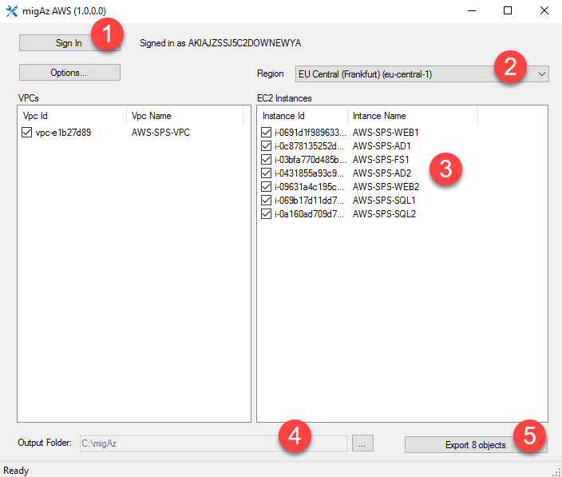
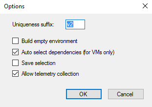

# AWS EC2 instances to Azure Resource Manager IaaS migration using migAz AWS

This article will show you how to use migAz AWS to migrate or clone AWS EC2 Virtual Machines  to Azure Resource Manager IaaS.

This project has adopted the [Microsoft Open Source Code of Conduct](https://opensource.microsoft.com/codeofconduct/). For more information see the [Code of Conduct FAQ](https://opensource.microsoft.com/codeofconduct/faq/) or contact [opencode@microsoft.com](mailto:opencode@microsoft.com) with any additional questions or comments.

## What it does

AWS to Azure Resource Manager migration tool for IaaS workloads (migAz AWS) is an additional option to migrate a complete set of AWS EC2 Virtual Machines to Azure Resource Manager IaaS resources. The migration can occur from any AWS Subscriptions to any Azure Resource Manager based subscriptions (ex: CSP subscriptions, EA subscriptions or PayAsYouGo subscriptions).

This article provides the functional details to use the tool for AWS to Azure Resource Manager migration of IaaS workloads. The tool exports the following resources:

**For VPC the tool exports the ARM corresponding object types**

- Virtual networks

- Subnets

- Public IP

- Network security groups

- Route tables

**For EC2 instance the tool exports the ARM corresponding object types**

- Load Balancer

- Load balancing rules

- Public IP

- Virtual machines

- Network interfaces

- Availability Sets

The tool uses AWS .net SDK to gather all the details on VPC and EC2 instance related resources. As per your selection, all the related configurations are exported into the JSON file which can be used for the deployment into Azure Resource Manager. The files created during the process are listed below:

- **Export.JSON** - This is the ARM template that the tool generates

- **MIGAZ-<YYYYMMDD>.log** - This file is created in the %USERPROFILE%\appdata\Local\MIGAZ and record each steps processed in the tool

 
> Migrating resources with these tool will require a small downtime for your EC2 instances as we use Azure Site Recovery to get the VHDs migrated to the Azure Resource Manager environment. It is recommened to plan for the downtime before the Migration. 

 

### Launch migAz.exe

**Step 1:** Click the “Sign In” button. The “Sign In” button will launch the Authentication page and user has to enter the AWS Access Key ID and the AWS Secret Access Key. ([get AWS Access Key](https://aws.amazon.com/developers/access-keys/))

Post successful authentication the Regions are loaded with the respective VPC and EC2 instance details.

**Step 2:** Select one of the Regions from the list and wait for the VPC and the EC2 instances to completely load. The status bar will show as “Ready” when all the components are loaded.

**Step 3:** The tool can export the configurations of VPC and the EC2 instance. User can select any of them or combination of the resources to export.

**Step 4:** The Export Objects button will be enabled only after choosing the Output folder. Once the resources are selected and Output Folder is set, user can click on Export Objects.

**Step 5:** The Export Objects will then collect all the properties of selected resources and create a JSON Template file in the Output Folder selected.

**Step 6:** Once the export completes, the next step is to deploy the template to your Azure environment. 

Follow the instructions below to start the deployment of the template using the cmdlet:

    New-AzureRmResourceGroupDeployment -Name "<Deployment Name>" -ResourceGroupName "<Resource Group Name>" -TemplateFile "<full path of the export.JSON>" -Verbose

> If EC2 instances were included on the export, an error will show up stating that the virtual machines VHDs were not found. This is expected since the blobs haven’t been copied yet to the new storage accounts.

If EC2 instances were included, delete the Virtual Machine and NIC resources created by the deployment. You will recreate them later in the process.

    .\Prepare.ps1 -ResourcegroupName "<Resource Group Name>" -TemplateFilePath "<Template File Path>" -Action DeleteVirtualMachines

Execute steps 7 to 11 only if virtual machines were included on the export.

**Step 7:** initiate and complete the blob copy of the required OS disks and data disks using Azure Site Recovery as it takes minimal downtime.

> Refer the link to know how to setup the Azure Site Recovery to get your EC2 instances migrated over to Azure with the VHDs:  https://docs.microsoft.com/en-us/azure/site-recovery/site-recovery-migrate-aws-to-azure

**Step 8**: Once the VMs are created by the Azure Site Recovery collect the VHD uri for all the OS and Data Disks.

    .\Prepare.ps1 -ResourcegroupName "<Resource Group Name>" -TemplateFilePath "<Template File Path>" -Action UpdateTemplateDisks

**Step 9:** Delete the Virtual Machine and NIC resources created by the Azure Site Recovery. All VHDs will be kept.

    .\Prepare.ps1 -ResourcegroupName "<Resource Group Name>" -TemplateFilePath "<Template File Path>" -Action DeleteVirtualMachines

**Step 10:** Re-deploy the export.JSON template since the VHD’s required for the virtual machines are available now.

    New-AzureRmResourceGroupDeployment -Name "<Deployment Name>" -ResourceGroupName "<Resource Group Name>" -TemplateFile "<full path of the export.JSON>" -Verbose

**Step 11:** Because the tool creates a Load Balancer with new DNS names, after the migration is complete, you need to change the DNS records that were pointing to the AWS Loadbalancer DNS name or IP to point to the new Load Balancer DNS name or IP.

## Tool Options

### Uniqueness suffix

When exporting storage accounts, the tool appends to the resource name the “uniqueness suffix” string to avoid names conflicts. You have the option to change this uniqueness suffix string.

### Build empty environment

If this option is selected, the selected virtual machines will be exported to export.json file as new virtual machines with empty data disks. By default, Windows virtual machines will be created using Windows Server 2012 R2 Datacenter SKU and Linux virtual machine will be created using Ubuntu Server 16.04.0-LTS SKU. You can change this by editing the export.json template and change the image references.

### Auto select dependencies

If this option is selected, when you select a EC2 instance, any dependent VPC is selected automatically.

### Save selection

If this option is selected, migAz will record the last selected resources per each subscription. When you reopen the tool, the same resources will be automatically selected.

### Allow telemetry collection

“Allow telemetry collection” is enabled by default. It is used to collect information such as AWS Access Key ID, Processed Resource Type, Processed Resource Location and the Execution date. This data is collected only to know the tool usage and it will remain only with the development team. You can disable this at any time.

## Scenarios

### Migration using new virtual network with different address space

One of the biggest priorities when planning for an ASM to ARM migration is to minimize the solution downtime. When possible, application level data replication is the option that guarantees minimal downtime, for example using SQL Server AlwaysOn replication.

If the migration scenario allows to create a new ARM virtual network with a different address space, you can create a site 2 site VPN connecting both AWS and ARM virtual networks. This will allow you to deploy an additional server on the new ARM environment, replicate the data and failover service with minimal downtime.

You can leverage migAz to help on the migration of servers that do not require data replication, like application servers and web servers.

### Migration using new virtual network with same address space

If it’s not possible to have a new ARM virtual network with a different address space, you will use the tool to migrate all solution virtual machines, but you need to plan for a downtime window. The downtime will be as large as the largest virtual machine to migrate (Depends on the total time required by the Unplanned Failover in Azure Site Recovery).

### Clone environment for testing

Planning and testing are key for a successful migration. The tool enables you to create a full copy of the environment and test it when deployed to ARM. This will allow you to proactively identify any configuration change required during the final migration execution.

### Clone environment with new virtual machines and data disks
It’s entirely possible that you opt for a full redeployment of the solution during the migration to ARM environment. The tool can help you to setup a new environment with similar configuration but with new and empty virtual machines.

Use “Build empty environment” option to enable this.

## Notes

### Storage accounts

A single Storage Account is created during the export process for all the Virtual Machines selected. All Virtual Machines will have the VHD uri referring to the same Storage Account. In case of multiple storage account required or if there is a need to change the storage account uri we need to handle it manually by modifying the JSON template exported by the tool before the deployment. 

### Loadbalancers & Availability Sets

The tool exports all the configured Loadbalancers for an EC2 instance selected and attach it with an availability set. There are chances that an EC2 instance is configured with more than 1 Loadbalancers in AWS. As the Azure supports only 1 loadbalancer per Virtual Machine, we need to manually update the JSON template to configure the Virtual Machine with only one loadbalancer and remove all the references of excluded loadbalancers and their availability sets.  

### Troubleshooting
The detailed logs  are captured in the location %USERPROFILE%\appdata\Local\\MigAz with the file name migAz-<YYYYMMDD>.log
In case of any issues during the deployment of the export.JSON you need to troubleshoot the template properties and fix the invalid entries. Report any issue on the tool site.

## Release Notes

### v1.0.0.3

- Update to BuildNetworkSecurityGroup functions
- Update Prepare.ps1 to execute parallel instead of sequential 
### v1.0.0.2

- Changes in DHCPOptions processing
- Update to GetVPCName function to remove spaces from name